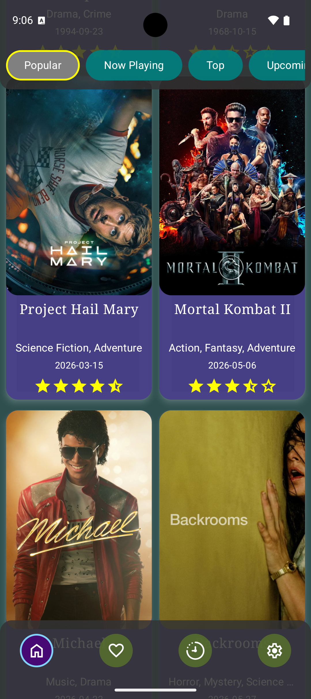
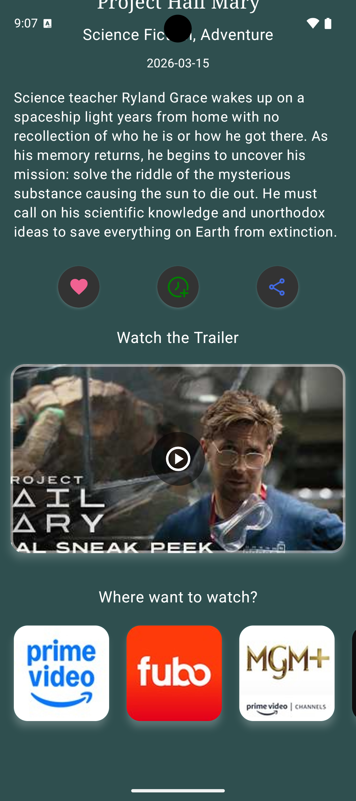
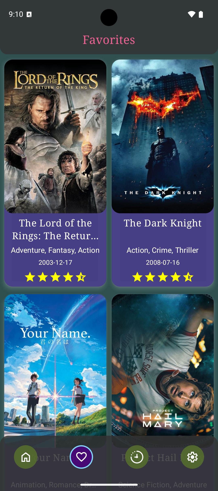
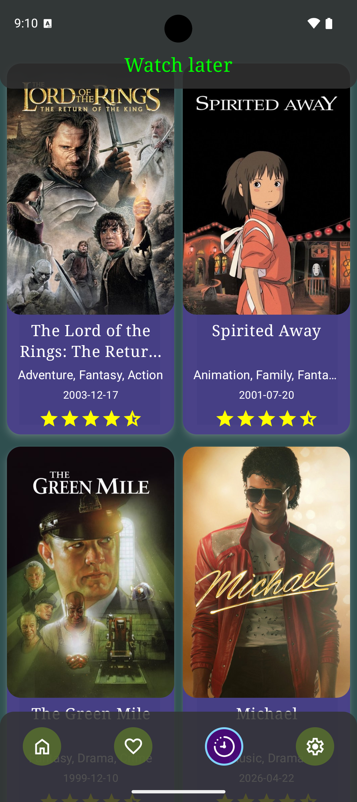
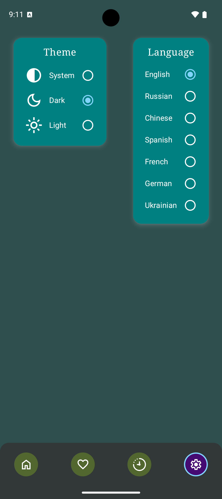

# 🎬 Films

An elegant, modern Android application for discovering movies, watching trailers, and finding
streaming providers. Built entirely with **Kotlin** and **Jetpack Compose**, following the
principles of **Clean Architecture** and **Offline-first** approach.


---

## 📱 Screenshots

<div align="center">
   
  
  
  
  
</div>

---

## ✨ Features

* **Modern UI/UX:** Built with Jetpack Compose & Material Design 3. Immersive Edge-to-Edge design
  with custom shadows, animations, and translucent glass-morphism effects.
* **Offline-First:** Movies are cached locally using **Room**. Instant loading from the database
  with smart background synchronization.
* **Reactive State Management:** Powered by `StateFlow` and `SharedFlow`. Safe handling of UI
  events (Debounce) and automatic cancellation of outdated network requests (`flatMapLatest`).
* **YouTube Trailer Integration:** Watch official movie trailers directly inside the app without
  redirecting to external browsers.
* **Watch Providers:** Discover where to legally stream, rent, or buy movies in your country (
  powered by JustWatch).
* **Dynamic Theme & Localization:** Seamless switching between Light/Dark themes and languages (
  EN/RU) on-the-fly using `DataStore` and `CompositionLocal` without Activity recreation.
* **Custom Animations:** Smooth Lottie-based Pull-to-Refresh indicator and fullscreen loaders.

---

## 🛠 Tech Stack

* **UI:** [Jetpack Compose](https://developer.android.com/jetpack/compose) (Material 3)
* **Architecture:** Clean Architecture, MVI-like state management
* **Dependency Injection:** [Koin](https://insert-koin.io/)
* **Networking:** [Ktor Client](https://ktor.io/)
* **Local Database:** [Room](https://developer.android.com/training/data-storage/room)
* **Preferences:
  ** [Preferences DataStore](https://developer.android.com/topic/libraries/architecture/datastore)
* **Image Loading:** [Coil](https://coil-kt.github.io/coil/)
* **Animations:** [Lottie for Compose](https://airbnb.io/lottie/)
* **Video Player:
  ** [Android YouTube Player](https://github.com/PierfrancescoSoffritti/android-youtube-player)
* **Asynchronous Programming:** Kotlin Coroutines & Flow

---

## ⚙️ Project Architecture

The project is heavily modularized by features and layers, enforcing a strict separation of
concerns:

* `Data Layer`: Handles remote (Ktor) and local (Room) data sources, parsing DTOs, and mapping them
  to domain models.
* `Domain Layer`: Contains pure Kotlin business logic and repository interfaces.
* `UI Layer`: Jetpack Compose screens, ViewModels, and UI-specific state handling.

---

## 🚀 Getting Started

To build and run the project, you need to provide your
own [TMDB API Key](https://developer.themoviedb.org/docs/getting-started).

1. Clone the repository:
   ```bash
   git clone https://github.com/YourUsername/Films.git
   ```
